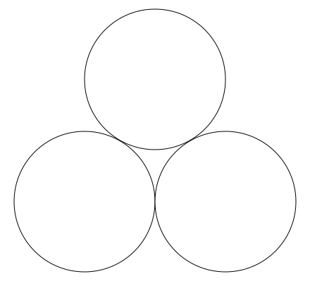
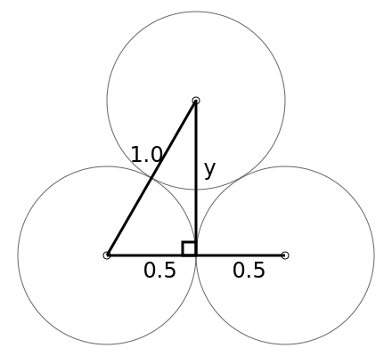
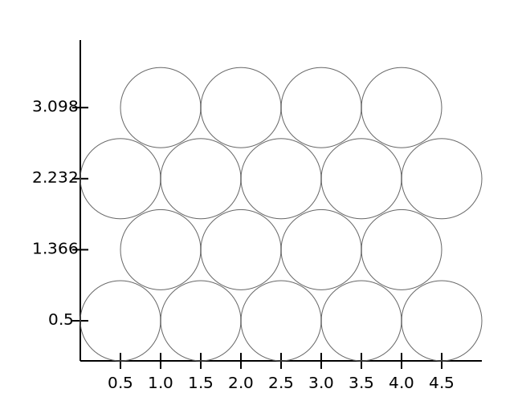

# Game Design Notes

---

## Ball Positions, or "orange stacking"

Balls or spheres do not stack neatly in a square grid.
Instead, they like to fall in the gaps left by the layer below.
You may be familiar with this when seeing a stack of oranges at the grocery store.

For our purposes here, we're considering only 2D "orange stacking".

Consider simple arrangement of two balls at below, and one above, all the same size.
The one above will sit horizontally between the two below, where the dip is largest.



### Determining ball center positions

- For ease of calculation, place center of lower-left ball as (0.0, 0.0)
- Each ball has 1-unit diameter
- Thus lower-right ball is centered at (1.0, 0.0)
- The point where two lower balls touch is at (0.5, 0.0), i.e. its radius
- The upper ball's horizontal center is also at 0.5 units, since sits in the dip between the two lower balls
- The upper ball touches both the bottom balls, at a diagonal
  Since they are touching, this distance is also 1.0 units (2x radius)
  
These are summarized by the triangles drawn on top of the balls below:



As such, the only unknown is the height between the lower & upper balls.
This is marked as _y_ in the diagram, and can be worked out with basic trigonometry.

Using Pythagorean theorem:

- y<sup>2</sup> + 0.5<sup>2</sup> = 1<sup>2</sup>
- y<sup>2</sup> = 1 - 0.25
- y = sqrt( 0.75 )
- y ~= 0.8660

---

## Placing balls in display coordinates

Ball must be entirely within play-field, and assume we place bottom & left walls, at x=0 & y=0 (on the axes) respectively.  Now bottom-left ball must be placed such that it touches x & y axes _at its edge_.

- Thus its center at (0.5, 0.5)
- Each ball to its right is `x += 1`, i.e. (**1.5**, 0.5), (**2.5**, 0.5), etc.

Due to stacking, balls in row above are shifted horizontally by half ball-width, or 1 radii.  But should be raised only by _y_, and not 1 full unit!

- Thus first upper ball's center is (**1.0**, 0.5 + 0.866) = (1.0, **1.366**)
- And balls to its right are also  `x += 1`, i.e. (**2.0**, 1.366), (**3.0**, 1.366), etc.

Third row up, uses same x-positions as bottom row.

- y_3rd_row = (0.5 + 2 * 0.866) = **2.232**
- ball center coords: (0.5, 2.232), (1.5, 2.232), (2.5, 2.232), etc.

Fourth row up, uses same x-positions as second row.

- y_4th_row = (0.5 + 3 * 0.866) = **3.098**
- ball center coords: (1.0, 3.098), (2.0, 3.098), (3.0, 3.098), etc.

This summarized in a diagram:



---

## Keeping Ball Grid in-memory

In above, we've determined _display_ positions for balls.

However we also need to store the balls, and address them as _grid_ positions in memory...

Since we have alternating sets of x positions, per row, such as

```text
    3| x x x |
    2|x x x x|
    1| x x x |
    0|x x x x|
y_pos+-------+
x_pos 0123456
```

A simple solution is to use a grid with **double** the x slots.

- for rows where balls touch left/right sides, use **even x** slots (0, 2, 4...)
- for alternate rows where balls **don't** touching left/right sides, use **odd x** slots (1, 3, 5...)

### Finding neighbors (to check for pop)

With orange stacking, balls arrange in equalateral triangles, that group into hexagons.

In the game, we need 3 or more adjacent balls with the same color to 'pop' or clear them.

```text
 3| x x x |
 2|x 1 2 x|
 1| 3 A 4 |
 0|x 5 6 x|
 y+-------+
 x 0123456
```

For position `A`, we should check its 6 immediate neighbors (`1` thru `6` above) -- hence the hexagon shape.

- A = grid position `(3, 1)`

Neighbor Grid Positions of A:

- Row above = `(2, 2)` and `(4, 2)`
- Same row = `(1, 1)` and `(5, 1)`
- Row below  = `(2, 0)` and `(4, 0)`
